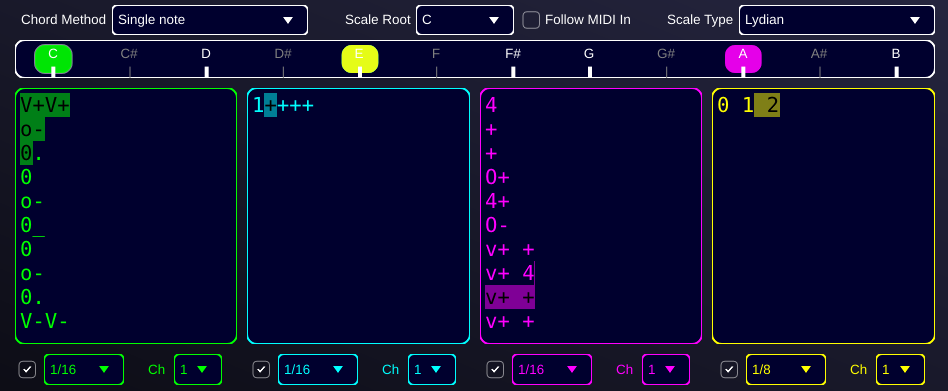

# TeAr - The Text Arpeggiator
A Polyphonic and Polyrhythmic MIDI Arpeggiator



TeAr is an advanced polyrhythmic and polyphonic MIDI arpeggiator plugin. It features four independent arpeggiator engines, each with its own pattern, subdivision, and MIDI output channel. This allows for the creation of complex, evolving musical phrases and textures.

At its core, TeAr is scale-aware. You can select a root note and one of many scale types, and the arpeggiators will intelligently conform to that musical context. A "Follow MIDI In" mode allows the scale's root to be changed dynamically by the notes you play.

Video demo: [https://www.youtube.com/watch?v=__oc9Wncv1Y](https://www.youtube.com/watch?v=__oc9Wncv1Y)

## Key Features

*   **Four Independent Arpeggiator Engines**: Create complex polyrhythms and layered melodic lines.
*   **Per-Arp Controls**: Each engine has its own On/Off switch, pattern editor, subdivision, and MIDI output channel.
*   **Powerful Pattern Language**: A rich text-based language for defining arpeggio sequences with modifiers for velocity, octave, and pitch.
*   **Comprehensive Scale Library**: A wide selection of musical scales and modes to define the harmonic landscape.
*   **Visual Feedback**: A real-time scale display highlights the active scale, its root, and the notes currently being played by each arpeggiator, color-coded for clarity.

## Pattern Language Documentation

The pattern string consists of characters that define the arpeggio's behavior at each step.

### Note Commands

| Command | Description |
| :--- | :--- |
| `1` to `9` | Plays a specific degree of the chord/scale (1=fundamental, 2=second, ..., 7=seventh). |
| `_` | Sustains the previously played note. |
| `.` | A rest; no note is played. |
| `+` | Plays the next degree in the chord (e.g., from 1 to 2). |
| `-` | Plays the previous degree in the chord (e.g., from 2 to 1). |
| `?` | Plays a random, valid note from the current chord. |
| `=` | Repeats the last played degree. |

### Pitch Modifiers

These are prefixed to a note command to alter its pitch for that step only.

| Command | Description | Example |
| :--- | :--- | :--- |
| `#` | Pitches the next note up by one semitone. | `#0` |
| `b` | Pitches the next note down by one semitone. | `b0` |

### Velocity Modifiers

Velocity is specified with a level from 1-8, which maps to a MIDI velocity from 16-127.

| Command | Description | Example |
| :--- | :--- | :--- |
| `vN` | **Local**: Sets velocity for the next note only. | `v80` (plays root at max velocity) |
| `v+` | **Local**: Increases velocity for the next note only. | `v+0` (plays root at the next velocity level) |
| `v-` | **Local**: Decreases velocity for the next note only. | `v-0` (plays root at a lower velocity level) |
| `VN` | **Global**: Sets velocity for all subsequent notes until the next `V` command. | `V40` (sets global velocity to 64) |
| `V+` | **Global**: Increases velocity for all subsequent notes until the next `V` command. | `V+0` (increases global velocity to the next level) |
| `V-` | **Global**: Decreases velocity for all subsequent notes until the next `V` command. | `V-0` (decreases global velocity to the previous level) |

### Octave Modifiers

| Command | Description | Example |
| :--- | :--- | :--- |
| `oN` | **Local**: Sets octave for the next note only (N is 0-7). | `o30` (plays root in octave 3) |
| `o+` | **Local**: Increases octave by one for the next note only. | `o+0` |
| `o-` | **Local**: Decreases octave by one for the next note only. | `o-0` |
| `ON` | **Global**: Sets octave for all subsequent notes (N is 0-7). | `O5` |
| `O+` | **Global**: Increases the global octave by one. | `O+` |
| `O-` | **Global**: Decreases the global octave by one. | `O-` |

---

## Implemented Scale Modes

| Scale/Mode Name | Intervals (from root) |
| :--- | :--- |
| **Major Scale Modes** | |
| Major (Ionian) | 0, 2, 4, 5, 7, 9, 11 |
| Dorian | 0, 2, 3, 5, 7, 9, 10 |
| Phrygian | 0, 1, 3, 5, 7, 8, 10 |
| Lydian | 0, 2, 4, 6, 7, 9, 11 |
| Mixolydian | 0, 2, 4, 5, 7, 9, 10 |
| Aeolian | 0, 2, 3, 5, 7, 8, 10 |
| Locrian | 0, 1, 3, 5, 6, 8, 10 |
| **Melodic Minor Modes** | |
| Melodic Minor | 0, 2, 3, 5, 7, 9, 11 |
| Dorian b9 | 0, 1, 3, 5, 7, 9, 10 |
| Lydian #5 | 0, 2, 4, 6, 8, 9, 11 |
| Lydian b7 (Bartok) | 0, 2, 4, 6, 7, 9, 10 |
| Mixolydian b13 | 0, 2, 4, 5, 7, 8, 10 |
| Locrian Natural 9 | 0, 2, 3, 5, 6, 8, 10 |
| Altered | 0, 1, 3, 4, 6, 8, 10 |
| **Harmonic Minor Modes** | |
| Harmonic Minor | 0, 2, 3, 5, 7, 8, 11 |
| Locrian Natural 6 | 0, 1, 3, 5, 6, 9, 10 |
| Ionian #5 | 0, 2, 4, 5, 8, 9, 11 |
| Dorian #4 | 0, 2, 3, 6, 7, 9, 10 |
| Phrygian Dominant | 0, 1, 4, 5, 7, 8, 10 |
| Lydian #2 | 0, 3, 4, 6, 7, 9, 11 |
| Altered bb7 (Ultralocrian) | 0, 1, 3, 4, 6, 8, 9 |
| **Other 7-note scales** | |
| Harmonic Major | 0, 2, 4, 5, 7, 8, 11 |
| Double Harmonic Major | 0, 1, 4, 5, 7, 8, 11 |
| Hungarian Minor | 0, 2, 3, 6, 7, 8, 11 |
| Neapolitan Major | 0, 1, 4, 5, 7, 9, 11 |
| Neapolitan Minor | 0, 1, 3, 5, 7, 8, 11 |
| **Non-diatonic scales** | |
| Major Pentatonic | 0, 2, 4, 7, 9 |
| Minor Pentatonic | 0, 3, 5, 7, 10 |
| Blues | 0, 3, 5, 6, 7, 10 |
| Whole Tone | 0, 2, 4, 6, 8, 10 |
| Octatonic (Half-Whole) | 0, 1, 3, 4, 6, 7, 9, 10 |
| Octatonic (Whole-Half) | 0, 2, 3, 5, 6, 8, 9, 11 |

---

## Building from Source

This project is built using the JUCE framework and requires the Projucer to generate the necessary project files for your IDE.

1.  **Clone the Repository**

    Clone the repository using the `--recursive` flag to ensure that the `cppMusicTools` submodule is also downloaded:

    ```bash
    git clone --recursive https://github.com/your-username/TeAr.git
    ```

    If you have already cloned the project without the submodules, you can initialize them with:
    ```bash
    git submodule update --init --recursive
    ```

2.  **Configure with Projucer**

    *   Open the `TeAr.jucer` file located in the project's root directory.
    *   In the Projucer's global settings (File > Global Paths...), make sure the "Path to JUCE" is set to the location of your JUCE modules.
    *   Click "Save Project" or "Save and Open in IDE..." to generate the build files for your system (e.g., a Visual Studio Solution or an Xcode project).

3.  **Compile**

    Open the generated project in your IDE (Visual Studio, Xcode, etc.) and build the "TeAr" target.

---

## Contact
olivier.doare@ensta.fr
