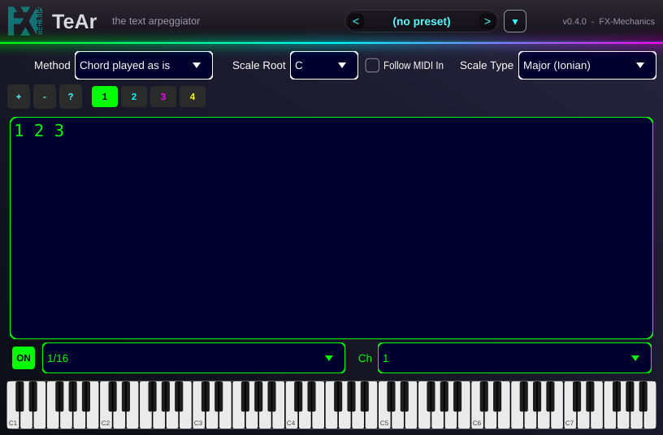

# TeAr - The Text Arpeggiator
A Polyphonic and Polyrhythmic MIDI Arpeggiator



TeAr is an advanced polyrhythmic and polyphonic MIDI arpeggiator plugin. It features a variable number of independent arpeggiator engines (add or remove them at any time), each with its own pattern, subdivision, and MIDI output channel. This allows for the creation of complex, evolving musical phrases and textures.

At its core, TeAr is scale-aware. You can select a root note and one of many scale types, and the arpeggiators will intelligently conform to that musical context. A "Follow MIDI In" mode allows the scale's root to be changed dynamically by the notes you play.

Video demo: [https://www.youtube.com/watch?v=__oc9Wncv1Y](https://www.youtube.com/watch?v=__oc9Wncv1Y)

Video tutorial: [https://www.youtube.com/watch?v=pWOuQep7nIs](https://www.youtube.com/watch?v=pWOuQep7nIs)

## Key Features

*   **Variable Number of Arpeggiator Engines**: Add or remove engines on the fly with the `+` / `-` buttons. Create complex polyrhythms and layered melodic lines.
*   **Per-Arp Controls**: Each engine has its own On/Off switch, pattern editor, subdivision, and MIDI output channel.
*   **Powerful Pattern Language**: A rich text-based language for defining arpeggio sequences with modifiers for velocity, octave, and pitch.
*   **Comprehensive Scale Library**: A wide selection of musical scales and modes to define the harmonic landscape.
*   **Visual Feedback**: A real-time scale display highlights the active scale, its root, and the notes currently being played by each arpeggiator, color-coded for clarity.

## Pattern Generator

Clicking the `?` button next to an arpeggiator's On/Off switch opens the Pattern Generator popup. This tool allows you to quickly create new rhythmic patterns.

*   **Randomize**: Generates a random pattern string using a mix of notes, rests, and modifiers.
*   **Euclidean Rhythm**: Generates a Euclidean rhythm pattern based on the following parameters:
    *   **Hits**: The number of active notes (pulses) in the sequence.
    *   **Steps**: The total length of the sequence.
    *   **Rot**: Rotates the pattern by a specified number of steps.

## Pattern Language Documentation

The pattern string consists of characters that define the arpeggio's behavior at each step.

### Note Commands

| Command | Description |
| :--- | :--- |
| `1` to `9` | Plays a specific degree of the chord/scale (1=fundamental, 2=second, ..., 7=seventh). |
| `_` | Sustains the previously played note. |
| `.` | A rest; no note is played. |
| `+` | Plays the next degree in the chord (e.g., from 1 to 2). |
| `-` | Plays the previous degree in the chord (e.g., from 2 to 1). |
| `?` | Plays a random, valid note from the current chord. |
| `=` | Repeats the last played degree. |

### Pitch Modifiers

These are prefixed to a note command to alter its pitch for that step only.

| Command | Description | Example |
| :--- | :--- | :--- |
| `#` | Pitches the next note up by one semitone. | `#0` |
| `b` | Pitches the next note down by one semitone. | `b0` |

### Velocity Modifiers

Velocity is specified with a level from 1-8, which maps to a MIDI velocity from 16-127.

| Command | Description | Example |
| :--- | :--- | :--- |
| `vN` | **Local**: Sets velocity for the next note only. | `v80` (plays root at max velocity) |
| `v+` | **Local**: Increases velocity for the next note only. | `v+0` (plays root at the next velocity level) |
| `v-` | **Local**: Decreases velocity for the next note only. | `v-0` (plays root at a lower velocity level) |
| `VN` | **Global**: Sets velocity for all subsequent notes until the next `V` command. | `V40` (sets global velocity to 64) |
| `V+` | **Global**: Increases velocity for all subsequent notes until the next `V` command. | `V+0` (increases global velocity to the next level) |
| `V-` | **Global**: Decreases velocity for all subsequent notes until the next `V` command. | `V-0` (decreases global velocity to the previous level) |

### Octave Modifiers

| Command | Description | Example |
| :--- | :--- | :--- |
| `oN` | **Local**: Sets octave for the next note only (N is 0-7). | `o30` (plays root in octave 3) |
| `o+` | **Local**: Increases octave by one for the next note only. | `o+0` |
| `o-` | **Local**: Decreases octave by one for the next note only. | `o-0` |
| `ON` | **Global**: Sets octave for all subsequent notes (N is 0-7). | `O5` |
| `O+` | **Global**: Increases the global octave by one. | `O+` |
| `O-` | **Global**: Decreases the global octave by one. | `O-` |

### Probability Modifier

`pN` prefixes a step or a group of steps and plays them only N×10% of the time (N is a digit from 1–9). On a failed roll the step becomes a rest unless a fallback is specified after a `:`.

#### Single-step form

```
pN X
pN X:Y
```

`X` is any note command (digit, `?`, `+`, `-`, `=`, `.`, `_`). On success `X` plays; on failure the step becomes a rest. With the optional `:Y` fallback, `Y` plays on failure instead.

| Example | Behaviour |
| :--- | :--- |
| `p5 1` | Plays degree 1 with 50% probability; otherwise rest. |
| `p3 1:2` | Plays degree 1 with 30% probability; plays degree 2 on failure. |
| `p7 1:.` | Plays degree 1 with 70% probability; silent rest on failure. |
| `p5 1:_` | Plays degree 1 with 50% probability; sustains previous note on failure. |
| `p5 1:?` | Plays degree 1 with 50% probability; plays a **random** chord note on failure. |

#### Group form

```
pN (success steps):(fallback steps)
```

`pN` gates an entire parenthesised group. On success, the steps inside `(…)` play; on failure the steps inside the fallback `(…)` play. Either branch can contain any note commands or modifiers. A space between `pN` and `(` is allowed.

| Example | Behaviour |
| :--- | :--- |
| `p5 (1 2 3):(4 5)` | Plays degrees 1–3 on success (50%); degrees 4–5 on failure. |
| `p5 (12):(34)` | Plays degrees 1,2 on success; degrees 3,4 on failure. |
| `p8 (O+ 1 2 3)` | Plays degrees 1–3 one octave up with 80% probability; rest on failure. |

The fallback `:(…)` is optional; omitting it makes the entire group silent on failure.

### Block Commands

Block commands wrap a group of steps to change their evaluation context.

#### Local Modifier Scope `( … )`

Any global modifier (`O+`, `O-`, `V+`, `V-`, etc.) used **inside** parentheses applies only within the block. When the closing `)` is reached the global octave and velocity are restored to the values they had at the opening `(`.

```
1 2 (O+ 1 2 3) 1 2
```
In this example `O+` raises the octave for steps 3–5 only; steps 1, 2, 6, 7 play at the original octave.

Parentheses can be nested.

#### Root-Relative Notes `" … "` *(Scale mode only = Single note)*

In **Scale** chord-method mode (single-note mode in the GUI), notes are normally played relative to the degree of the pressed MIDI note within the selected scale. Steps placed between double-quotes are instead played relative to the **Scale Root** parameter - that is, as if the root note of the scale were pressed regardless of what key is actually held.

```
1 2 "1 2 3" 4
```
Here steps 3–5 are always anchored to the scale root while steps 1, 2, 4 follow the pressed note's degree as usual.

> **Note**: In versions up to 0.2, `"` was used to "repeat last degree" command. The dedicated command for that is now  `=`.

---

## Implemented Scale Modes

| Scale/Mode Name | Intervals (from root) |
| :--- | :--- |
| **Major Scale Modes** | |
| Major (Ionian) | 0, 2, 4, 5, 7, 9, 11 |
| Dorian | 0, 2, 3, 5, 7, 9, 10 |
| Phrygian | 0, 1, 3, 5, 7, 8, 10 |
| Lydian | 0, 2, 4, 6, 7, 9, 11 |
| Mixolydian | 0, 2, 4, 5, 7, 9, 10 |
| Aeolian | 0, 2, 3, 5, 7, 8, 10 |
| Locrian | 0, 1, 3, 5, 6, 8, 10 |
| **Melodic Minor Modes** | |
| Melodic Minor | 0, 2, 3, 5, 7, 9, 11 |
| Dorian b9 | 0, 1, 3, 5, 7, 9, 10 |
| Lydian #5 | 0, 2, 4, 6, 8, 9, 11 |
| Lydian b7 (Bartok) | 0, 2, 4, 6, 7, 9, 10 |
| Mixolydian b13 | 0, 2, 4, 5, 7, 8, 10 |
| Locrian Natural 9 | 0, 2, 3, 5, 6, 8, 10 |
| Altered | 0, 1, 3, 4, 6, 8, 10 |
| **Harmonic Minor Modes** | |
| Harmonic Minor | 0, 2, 3, 5, 7, 8, 11 |
| Locrian Natural 6 | 0, 1, 3, 5, 6, 9, 10 |
| Ionian #5 | 0, 2, 4, 5, 8, 9, 11 |
| Dorian #4 | 0, 2, 3, 6, 7, 9, 10 |
| Phrygian Dominant | 0, 1, 4, 5, 7, 8, 10 |
| Lydian #2 | 0, 3, 4, 6, 7, 9, 11 |
| Altered bb7 (Ultralocrian) | 0, 1, 3, 4, 6, 8, 9 |
| **Other 7-note scales** | |
| Harmonic Major | 0, 2, 4, 5, 7, 8, 11 |
| Double Harmonic Major | 0, 1, 4, 5, 7, 8, 11 |
| Hungarian Minor | 0, 2, 3, 6, 7, 8, 11 |
| Neapolitan Major | 0, 1, 4, 5, 7, 9, 11 |
| Neapolitan Minor | 0, 1, 3, 5, 7, 8, 11 |
| **Non-diatonic scales** | |
| Major Pentatonic | 0, 2, 4, 7, 9 |
| Minor Pentatonic | 0, 3, 5, 7, 10 |
| Blues | 0, 3, 5, 6, 7, 10 |
| Whole Tone | 0, 2, 4, 6, 8, 10 |
| Octatonic (Half-Whole) | 0, 1, 3, 4, 6, 7, 9, 10 |
| Octatonic (Whole-Half) | 0, 2, 3, 5, 6, 8, 9, 11 |

---

## Installation

Pre-built binaries are available on the [Releases page](https://github.com/odoare/TeAr/releases).

### macOS

The macOS builds are universal (Apple Silicon and Intel) and require macOS 10.13 or later.

TeAr is free software and is not signed with an Apple Developer ID (that is a paid Apple subscription). macOS marks anything downloaded through a browser as untrusted, and a DAW will then skip the plugin during its scan, usually with no error at all: it simply never shows up. Clearing that flag is a one-line command and is required whichever package you use.

Using the installer:

1. Download `TeAr-macOS.pkg`. macOS will refuse to open it on a double-click, so right-click it and choose **Open**, then confirm.
2. Run the installer (it puts the VST3 in `/Library/Audio/Plug-Ins/VST3` and the AU in `/Library/Audio/Plug-Ins/Components`).
3. Open Terminal and run:

   ```sh
   xattr -dr com.apple.quarantine /Library/Audio/Plug-Ins/VST3/TeAr.vst3
   xattr -dr com.apple.quarantine /Library/Audio/Plug-Ins/Components/TeAr.component
   ```

4. Restart your DAW. Logic Pro users may need to trigger a rescan in **Plug-in Manager**.

Using the zips instead: download `TeAr-VST3-macOS-universal.zip` and/or `TeAr-AU-macOS-universal.zip`, copy `TeAr.vst3` to `/Library/Audio/Plug-Ins/VST3` and `TeAr.component` to `/Library/Audio/Plug-Ins/Components` (or the same paths under `~/Library` for a single user), then run the same `xattr` commands above on the files you copied and restart your DAW.

If TeAr still does not appear after clearing quarantine, that is a real bug rather than a signing problem, so please open an issue.

> **Plugin type and usage in Logic Pro / GarageBand**
>
> TeAr is shipped as an **AU instrument** (`aumu`) rather than a MIDI FX (`aumi`), because instrument-with-MIDI-out is the only format that works consistently across every major DAW (Logic, Live, Cubase, Bitwig, Reaper, Studio One, FL Studio). Logic's dedicated MIDI FX slot would be a more natural home for an arpeggiator, but plugins placed there are restricted to AU and unavailable in most other hosts.
>
> **Recommended workflow in Logic Pro:**
>
> 1. Create a **Software Instrument** track and load **TeAr** on it. (TeAr itself produces no audio — its output is silent.)
> 2. Create a second Software Instrument track with the synth/sampler you actually want to hear.
> 3. On the TeAr track, route the MIDI output to the target instrument track using one of:
>    - **External Instrument** + IAC bus (most reliable), or
>    - the **MIDI FX → Modifier → Re-route** trick on the destination track,
>    - or any third-party MIDI routing utility you already use.
> 4. Set each TeAr engine's MIDI output channel to match what the destination instrument listens on (default: omni / channel 1).
>
> The same instrument-with-MIDI-out workflow applies in **Ableton Live**, **Bitwig**, **Cubase**, **Studio One**, **Reaper**, etc. — consult your DAW's documentation for routing MIDI between two instrument tracks.

### Windows

1. Download `TeAr-VST3-Windows-x86_64.zip`.
2. Unzip and copy the `TeAr.vst3` directory to `C:\Program Files\Common Files\VST3`.
3. Rescan VST3 plugins in your DAW (in Reaper: **Options → Preferences → Plug-ins → VST → Re-scan**).

### Linux

1. Download `TeAr-VST3-Linux-x86_64.zip` (Intel/AMD) or `TeAr-VST3-Linux-arm64.zip` (ARM).
2. Unzip and copy the `TeAr.vst3` directory to `~/.vst3/`.
3. Rescan VST3 plugins in your DAW (in Reaper: **Options → Preferences → Plug-ins → VST → Re-scan**).

---

## Building from Source

This project uses CMake. JUCE and the FxmeJuceTools module are expected as sibling directories.

1.  **Clone the Repository**

    ```bash
    git clone --recursive https://github.com/odoare/TeAr.git
    cd TeAr
    ```

2.  **Set up dependencies** (one-time, in the parent directory)

    ```bash
    # JUCE
    git clone --branch 8.0.12 https://github.com/juce-framework/JUCE.git ../JUCE

    # FxmeJuceTools custom module
    git clone https://github.com/odoare/FxmeJuceTools.git ../FxmeJuceTools_repo
    mkdir -p ../JUCE/usermodules
    ln -s $(pwd)/../FxmeJuceTools_repo/module/FxmeJuceTools ../JUCE/usermodules/FxmeJuceTools
    ```

3.  **Configure and build**

    ```bash
    cmake -B build -DCMAKE_BUILD_TYPE=Release
    cmake --build build --config Release --parallel
    ```

    The built plugin will be in `build/TeAr_artefacts/Release/`.

---

## Contact
olivier.doare@ensta.fr
